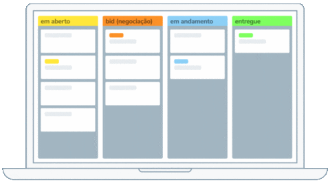

# TaskForge

## Instruções para execução

**Instalações necessárias**

*   sdk do .net 8
*   docker

**Rodando a aplicação:**

1.  Acesse a past pasta _Src_ do projeto
2.  Execute o comando `docker-compose up` para criação e execução dos containers da aplicação e do postgres
3.  Execute o comando `dotnet ef database update --startup-project Api --project Infrastructure` para criação da base de dados, tabelas e seed de dados na tabela Users
4.  A aplicação estará rodando no endereço [http://localhost:8080](http://localhost:8080) 

Links úteis:

*   [Collection postman com todos os endpoints disponíveis](assets/TaskForge.postman_collection.json)
*   [Lista de todos os ususário que são carregados via seed, para user nos requests](assets/Users.png)

**Testando a aplicação:**

1.  Acesse a paste Tests
2.  Execute o comando `dotnet test`
    
    obs: para execução dos testes de integração, a conteiner do postgres precisa estar em execução
    

---

## Fase 2 - sugestões de refinamento para futuras melhorias

| **Tema** | **Observações** |
| --- | --- |
| Restrição de remoção de projetos | Além de impedir a remoção de projetos com tarefas pendentes, devemos restringir essa ação apenas ao autor do projeto ou a usuários com a função de gerente. |
| Observações das tarefas | Acredito que manter informações de observações das tarefas na tabela de histórico de alterações pode gerar confusão. Sugiro separar as observações em uma estrutura de banco de dados própria, tornando a gestão desses dados mais clara e organizada. |
| Remoção de Tarefas | Devemos avaliar se permitiremos a remoção de tarefas mesmo que já tenham sido concluídas, tenham alta prioridade ou não tenham sido modificadas há algum tempo. |
| Edição de Projeto | Adicionar um endpoint para edição de projetos permitirá aos usuários atualizarem informações relevantes dos projetos, como título, descrição, etc. |
| Status dos projetos | Implementar status para os projetos, como "aguardando refinamento", "em execução", "pendente", "concluído" e “removido”. Isso fornecerá uma visão mais clara do progresso e do estado atual de cada projeto. |
| Histórico de atualizações geral | Criar um histórico de atualizações geral que abranja todas as entidades da aplicação e não apenas tarefas. Isso vai nos permitir rastrear e auditar todas as mudanças realizadas no sistema de forma mais abrangente. |
| Gestão de Comentários | Separar as observações das tarefas em uma estrutura própria, para termos uma gestão de comentários mais eficiente e distinguir claramente entre as alterações feitas na tarefa e os comentários adicionados pelos usuários. |
| Endpoints para gestão de usuários | Adicionar endpoints para a gestão de usuários, incluindo operações como criação, atualização e exclusão de usuários. |
| Listagem de todos os projetos | Implementar filtros no endpoint de listagem de projeto para listar todos os projetos, independentemente do usuário associado. Isso é importante para os gestores poderem ter uma visão completa do cenário atual de todos os projetos. |
| Alteração de prioridade de tarefa | Permitir a alteração da prioridade de uma tarefa após sua criação dará maior flexibilidade na gestão das tarefas pois permite que os usuários ajustem as prioridades conforme as mudanças de prioridade do negócio. |
| Reações às observações | Adicionar a capacidade de os usuários reagirem a um comentário ou tarefa estabelece uma forma mais rica de comunicação e colaboração entre os membros da equipe. |
| Anexos | Implementar a possibilidade de anexar arquivos às tarefas ou projetos |
| Seguir tarefas ou projetos | Adicionar a funcionalidade de "seguir" uma tarefa ou projeto para que os usuários recebam atualizações e notificações sobre atividades específicas que lhes interessem. |
| Seleção de período nos relatórios | Permitir que o usuário selecione o número de dias para o relatório de desempenho para ficar mais adaptável às necessidades específicas de análise do usuário. |

---

## Fase 3 - possíveis melhoraria no projeto

| **Proposta**                                      | **Observações**                                                                                                                                                                                                                                                                                                                           |
|------------------------------------------------|------------------------------------------------------------------------------------------------------------------------------------------------------------------------------------------------------------------------------------------------------------------------------------------------------------------------------------------|
| Utilizar Redis para consultas frequentes       | Implementar o Redis para fazer cache de dados frequentemente acessados, o que pode levar a uma significativa diminuição da latência para certos endpoints.                                                                                                                                                                              |
| Implementar um pipeline de CI/CD               | Criar um pipeline de integração e entrega contínua (CI/CD) para garantir a qualidade do código enviado ao repositório. Questões como integridade de execução, realização automática de testes de integração e unitários, conformidade com os padrões de codificação estabelecidos e implantação automática, entre outros, podem estar representados nesse pipeline. |
| Utilizar Kubernetes para gestão de deploy e orquestração | Implementar um cluster Kubernetes (AKS?) para automatizar a implantação em produção, gerenciar a orquestração da aplicação e garantir escalabilidade.                                                                                                                                                                                |
| Adotar a arquitetura CQRS                      | Considerar a adoção da arquitetura Command Query Responsibility Segregation (CQRS) para separar as operações de leitura e escrita, permitindo escalar de forma independente essas duas operações.                                                                                                                                   |
| Implementar monitoramento e logging            | Introduzir ferramentas de monitoramento e logging para acompanhar o desempenho da aplicação, identificar possíveis problemas e garantir uma operação contínua e eficiente.                                                                                                                                                           |
| Aplicar princípios de segurança                | Reforçar a segurança da aplicação implementando práticas recomendadas, como autenticação e autorização, criptografia e proteção contra ataques comuns, como injeção de SQL e cross-site scripting (XSS).                                                                                                                         |
| Realizar análise de desempenho                 | Realizar análises periódicas de desempenho para identificar gargalos e áreas de melhoria, otimizando consultas de banco de dados, algoritmos e processos para garantir uma experiência do usuário mais rápida e eficiente.                                                                                                          |
